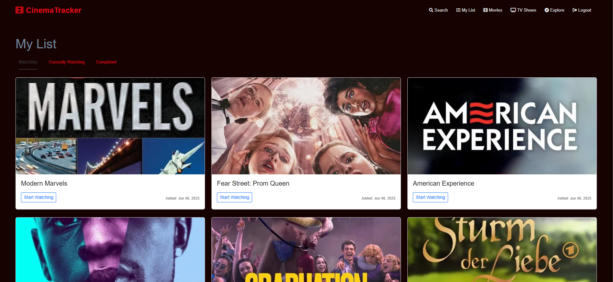
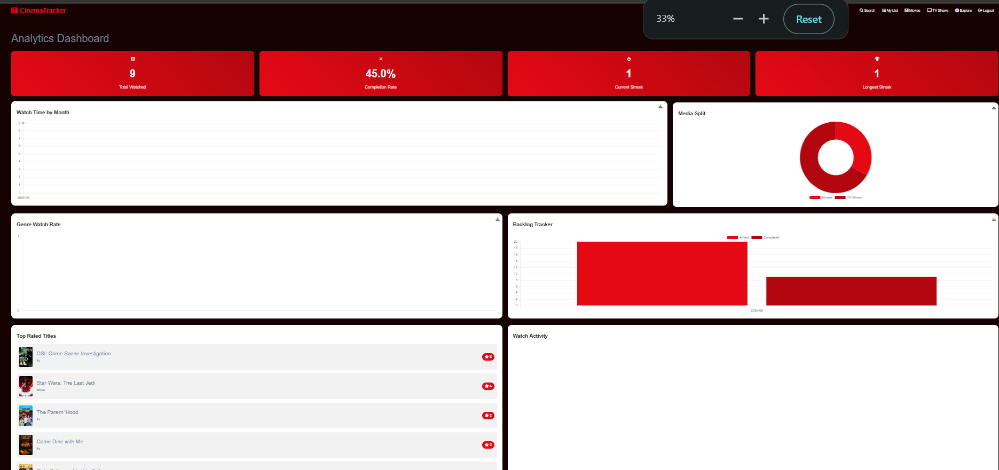
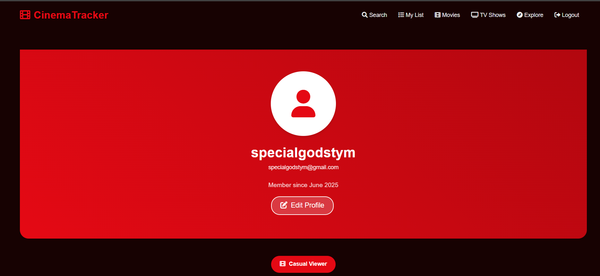

# CineTrack 🎬

CineTrack is a modern web application for tracking your movies and TV shows watching experience. Built with Django and styled with a Netflix-inspired design, it offers a comprehensive solution for managing your watchlist and analyzing your viewing habits.

## Features ✨

### Watchlist Management
- Add movies and TV shows to your watchlist
- Mark items as "Currently Watching" or "Completed"
- Rate completed items on a 5-star scale
- Search for movies and TV shows using TMDB's extensive database
<!-- - Get personalized recommendations based on your watch history -->

### Analytics Dashboard 📊
- Interactive charts and visualizations powered by Chart.js
- Genre distribution analysis (pie/bar charts)
- Monthly watch time tracking (line chart)
- Movies vs TV Shows split (doughnut chart)
- Completion rate statistics
- Top 5 rated titles
- Watch streak tracking
- Backlog analysis (added vs completed items)

### User Profile System 👤
- Personalized user profiles
- Watch statistics (total watched, average rating)
- Auto-generated favorite genres
- Watch persona (e.g., "Cinephile", "Movie Buff")
- Movies vs Shows count
- Watch streaks tracking
- Profile customization options

## Screenshots 📸

### Watchlist

*Personal watchlist with movie/show cards*

### Analytics Dashboard

*Interactive analytics dashboard with various charts and statistics*

### Profile Page

*User profile showing watch statistics and favorite genres*

## Tech Stack 🛠️

- **Backend**: Django 5.1.2
- **Database**: PostgreSQL
- **Frontend**: 
  - HTML/CSS/JavaScript
  - Bootstrap 5
  - Chart.js for visualizations
- **APIs**: TMDB (The Movie Database) API
- **Authentication**: django-allauth

## Setup 🚀

1. Clone the repository:
```bash
git clone https://github.com/yourusername/cinetrack.git
cd cinetrack
```

2. Create and activate a virtual environment:
```bash
python -m venv venv
source venv/bin/activate  # On Windows: venv\Scripts\activate
```

3. Install dependencies:
```bash
pip install -r requirements.txt
```

4. Set up environment variables in `.env`:
```
DEBUG=True
SECRET_KEY=your-secret-key
DATABASE_URL=your-database-url
TMDB_API_KEY=your-tmdb-api-key
```

5. Run migrations:
```bash
python manage.py migrate
```

6. (Optional) Seed the database with sample data:
```bash
python manage.py seed_watchlist 50  # Creates 50 watchlist entries
```

7. Run the development server:
```bash
python manage.py runserver
```

## Environment Variables 🔐

| Variable | Description |
|----------|-------------|
| `DEBUG` | Debug mode (True/False) |
| `SECRET_KEY` | Django secret key |
| `DATABASE_URL` | Database connection URL |
| `TMDB_API_KEY` | TMDB API access token |

## Usage 📝

1. Register a new account or login
2. Search for movies/shows using the search bar
3. Add items to your watchlist
4. Mark items as "Currently Watching" or "Completed"
5. Rate completed items
6. Visit your profile to see your statistics
7. Check the analytics dashboard for detailed insights

## Contributing 🤝

1. Fork the repository
2. Create a new branch (`git checkout -b feature/amazing-feature`)
3. Commit your changes (`git commit -m 'Add amazing feature'`)
4. Push to the branch (`git push origin feature/amazing-feature`)
5. Open a Pull Request

## License 📄

This project is licensed under the MIT License - see the [LICENSE](LICENSE) file for details.

## Acknowledgments 🙏

- [TMDB](https://www.themoviedb.org/) for their extensive movie and TV show database
- [Chart.js](https://www.chartjs.org/) for beautiful charts
- [Bootstrap](https://getbootstrap.com/) for responsive design components 